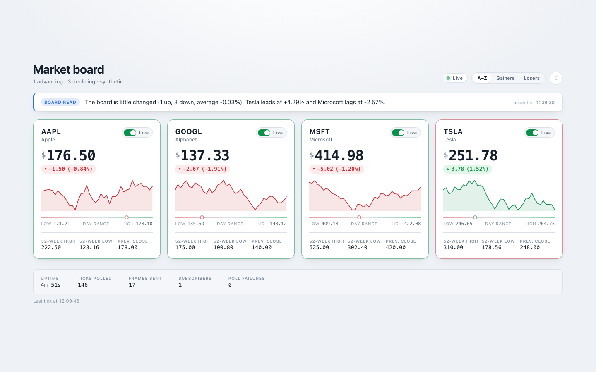
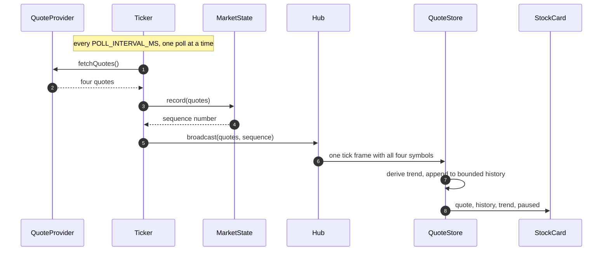
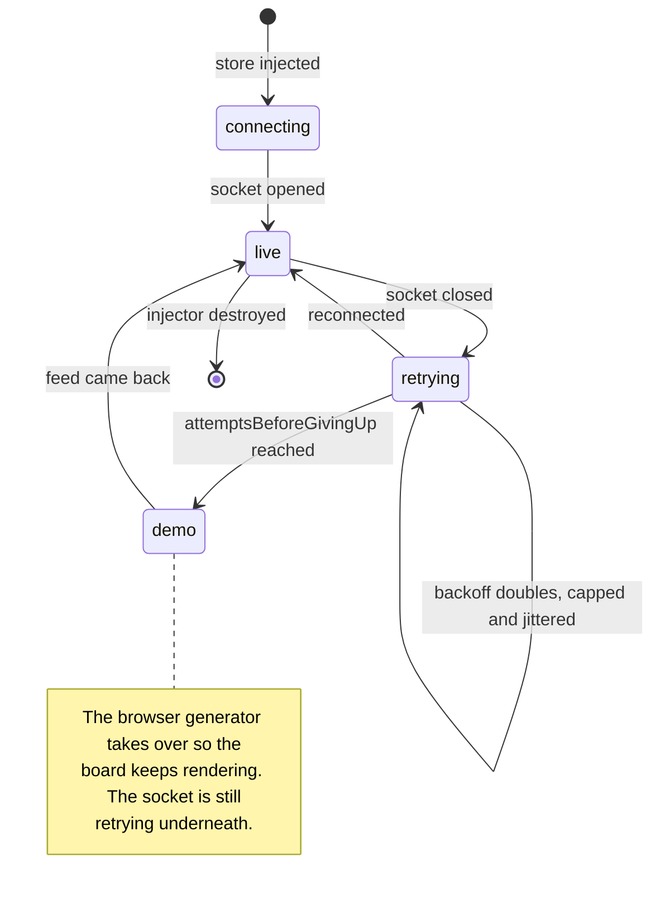
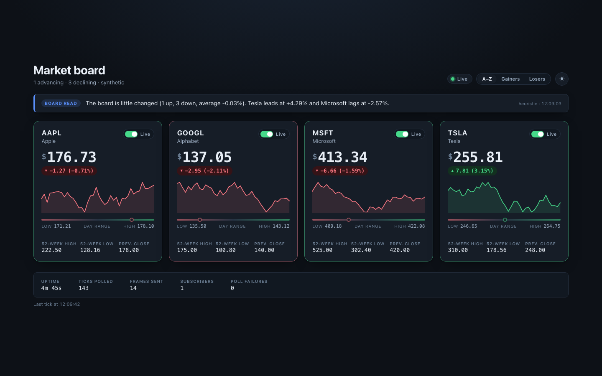
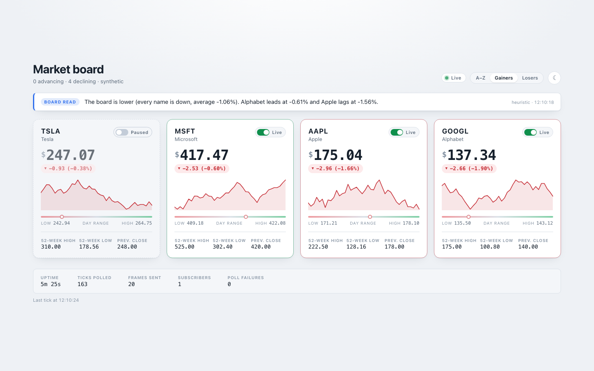

# Market board

A live quote dashboard: an Angular 19 app rendering four symbols off a WebSocket,
and a small Node sidecar that polls a market-data vendor and fans the results out
to every connected browser.

It runs with no accounts and no API keys. With `FINNHUB_API_KEY` unset the sidecar
serves a seeded random walk instead of live quotes, which means `git clone` to a
working dashboard is two commands and no signup.



## Running it

Two processes. The feed first:

```bash
npm install --prefix server
npm run feed          # http + websocket on 127.0.0.1:7202
```

Then the app, in a second terminal:

```bash
npm install
npm start             # http://localhost:7201
```

`npm start` proxies `/api` to the feed (see `proxy.conf.json`), so the browser only
ever talks to one origin.

You can skip the first terminal. After four failed connection attempts the page falls
back to an in-browser generator, labelled **Demo data** in the status pill; the socket
keeps retrying underneath and live quotes take over the moment the feed appears.

## Where a price comes from

One poll produces one frame containing every symbol, not one frame per symbol. Four
separate frames would mean four change-detection passes for a single logical update.



`Ticker` holds an in-flight guard rather than a bare `setInterval`, so a slow vendor
cannot start a second poll on top of the first and compound from there. A browser that
connects mid-session is sent the current board and its history immediately, so a new
tab renders a populated chart rather than waiting out a poll interval on an empty grid.

Components at the bottom of that chain are presentational. `StockCard` has no timer,
no subscription and no state of its own — it takes `quote`, `history`, `trend` and
`paused` as inputs and renders them under `OnPush`. Pausing lives in the store, which
keeps serving a frozen quote for one symbol while its neighbours keep updating.

## When the feed goes away

A dashboard whose feed has quietly died looks exactly like one that is working. This
state machine exists to make that failure visible.



The reconnect backs off exponentially, caps at 15 seconds and adds jitter, so a fleet
of open tabs does not stampede a feed that has just restarted. The socket and its retry
timer are torn down through `DestroyRef`, which stops a reconnect loop outliving the
injector that started it.

The server side of that concern is a heartbeat: every client is pinged on a timer and
terminated after two missed pongs, and a client whose send buffer passes 1 MiB is
dropped rather than allowed to grow the process out of memory.

## Two providers, one interface

A quote provider is an object with a name, a credentials flag and
`fetchQuotes(): Promise<Quote[]>`. There are two:

| Name        | Source                              | Needs a key       |
| ----------- | ----------------------------------- | ----------------- |
| `synthetic` | seeded mean-reverting random walk   | no                |
| `finnhub`   | `finnhub.io` `/quote` and `/metric` | `FINNHUB_API_KEY` |

The sidecar picks `finnhub` when a key is present and `synthetic` otherwise;
`QUOTE_PROVIDER` overrides that. Adding a third vendor means one file under
`server/src/providers/` and one line in the registry.

The live provider is wrapped so a vendor outage degrades to generated data instead of
an empty board, and says so: the active source reads `finnhub (degraded to synthetic)`
while that is happening. It fetches all four symbols in parallel and caches each
52-week band for an hour, because that band barely moves intraday and re-fetching it
every tick exhausts the free tier within minutes.

The synthetic provider is seeded, so the same `FEED_SEED` replays the same session
tick for tick — which is what makes the screenshots below reproducible.

## The board read

The strip under the header is one sentence describing the board, generated by the
sidecar and served from `/commentary`. It has the same two-provider shape:

- **`heuristic`** (default) — arithmetic. Sorts by percentage move, counts advancers
  and decliners, names the leader and the laggard. No network, no key, no cost.
- **`anthropic`** — asks Claude for the sentence, given only the numbers and an
  instruction not to invent news or causes.

Set `ANTHROPIC_API_KEY` to use the second. Every failure path in it — missing key, API
error, declined request, empty response — falls back to the heuristic sentence, so
turning the model on can improve the wording and cannot break the page. The strip names
whichever provider wrote it. Observed heuristic output:

> The board is little changed (1 up, 3 down, average -0.03%). Tesla leads at +4.29%
> and Microsoft lags at -2.57%.

The sentence is cached for `COMMENTARY_TTL_MS` and concurrent callers share one
in-flight generation, so the cost does not scale with the number of open tabs.

## One symbol list

`shared/symbols.json` at the repo root defines the symbol universe once. The Angular
app imports it, the sidecar reads it from disk, and neither holds a second copy that
someone has to remember to keep in step.

```json
{ "symbol": "TSLA", "name": "Tesla", "referencePrice": 248, "volatility": 0.011 }
```

`referencePrice` doubles as the previous close and as the level the synthetic walk
reverts toward. `volatility` is the per-tick shock size, which is why TSLA moves more
than MSFT on the demo board.

## What the sidecar exposes

| Route         | Purpose                                                              |
| ------------- | -------------------------------------------------------------------- |
| `/stream`     | WebSocket. `snapshot` on connect, then one `tick` frame per poll.    |
| `/healthz`    | `200` once quotes are flowing, `503` before the first poll lands.    |
| `/metrics`    | Uptime, polls, failures, frames sent, connected clients, last error. |
| `/commentary` | The generated sentence, its provider and when it was written.        |

`curl -s localhost:7202/healthz` answers `{"status":"ok","symbols":4,"lastError":null}`.
The footer strip on the dashboard renders `/metrics`, so the feed's health is visible
without opening a terminal.

## Interface

Cards colour by session direction and pair the colour with an arrow, so gain and loss
survive greyscale and the common forms of colour blindness. The tick flash is a border
tint rather than a full-tile fill — a card repainting completely every two seconds is
hard to read for long. Only the price region carries `aria-live`; marking the whole
card live would re-announce the ticker, the name and every statistic on every tick.

Theme follows the system preference, can be toggled, and is remembered. `?theme=dark`
forces it, which is how this was captured:



Sorting by gainers or losers reorders the board, and a paused card is dashed and dimmed:



## Settings

Every one is optional and every one has a default; `.env.example` lists them all.

| Variable              | Default              | Effect                                    |
| --------------------- | -------------------- | ----------------------------------------- |
| `FINNHUB_API_KEY`     | _unset_              | Switches the quote source to live data.   |
| `ANTHROPIC_API_KEY`   | _unset_              | Switches commentary to the model.         |
| `QUOTE_PROVIDER`      | key-dependent        | `synthetic` or `finnhub`.                 |
| `COMMENTARY_PROVIDER` | key-dependent        | `heuristic` or `anthropic`.               |
| `FEED_SEED`           | `20240695`           | Seeds the generated session.              |
| `POLL_INTERVAL_MS`    | `2000`               | How often the vendor is polled.           |
| `HISTORY_DEPTH`       | `40`                 | Sparkline length, and the snapshot depth. |
| `PORT` / `HOST`       | `7202` / `127.0.0.1` | Where the sidecar listens.                |

Parsing happens once, in `server/src/config.js`, and a nonsense value fails at startup
rather than at the first tick:

```console
$ PORT=eighty npm run feed
Error: PORT must be a positive number, got "eighty"
```

## Tests

Two suites, no shared runner. The feed's tests are `node:test` with no dependencies;
the app's are Karma and Jasmine against headless Chrome.

```bash
npm run test:feed     # 57 tests
npm test              # 95 tests
npm run test:all      # both
npm run lint          # eslint + prettier --check
```

Both were green at the last run: `57 pass, 0 fail` and `TOTAL: 95 SUCCESS`.

The feed suite includes an end-to-end test that starts the real server on a port in
the 7205-7209 range, opens a real WebSocket, and asserts on the frames and on
`/healthz`, `/metrics` and `/commentary`. The app suite covers the reconnect backoff
against a fake socket, the frame parser against malformed input, and the store's pause
and sort behaviour against a fake transport.

`mulberry32` exists in both languages, in `server/src/providers/synthetic.js` and
`src/app/core/random.ts`. Both suites assert the same first value for seed 42, so the
two copies cannot drift into producing different demo data.

## Containers

```bash
docker compose up --build       # app on :7201, feed on the internal network
```

One `Dockerfile` with two targets: `feed` is Node running as the `node` user, `web` is
`nginx-unprivileged` serving the compiled bundle and proxying `/api` and `/stream`
through to the feed. Both have health checks and `web` waits for the feed to pass its
own. The production build is 225.51 kB raw, 66.99 kB over the wire.

## What this does not do

- **Four symbols, fixed.** There is no symbol search and no way to add one from the
  UI — editing `shared/symbols.json` and restarting is the only route.
- **No persistence.** Price history lives in memory in the sidecar and in the browser
  tab. Restarting the feed starts the chart again from nothing.
- **One feed process.** `MarketState` and the client registry are in-process, so a
  second replica would poll the vendor a second time and serve its own history. A
  shared cache and a pub/sub fan-out are where that would have to go.
- **The 52-week band is estimated** from ratios of the current price when Finnhub has
  no metric for a symbol, and the UI does not mark it as an estimate.
- **Docker images are unbuilt here.** `docker compose config` parses, but the images
  have not been built or booted in this environment.
